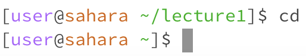
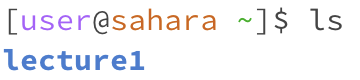
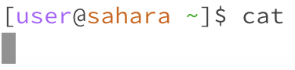
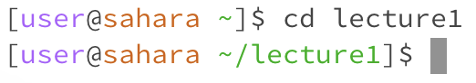
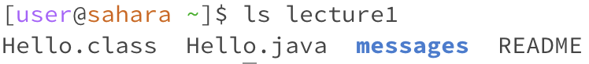
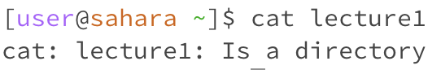
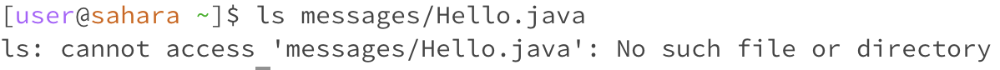
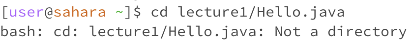
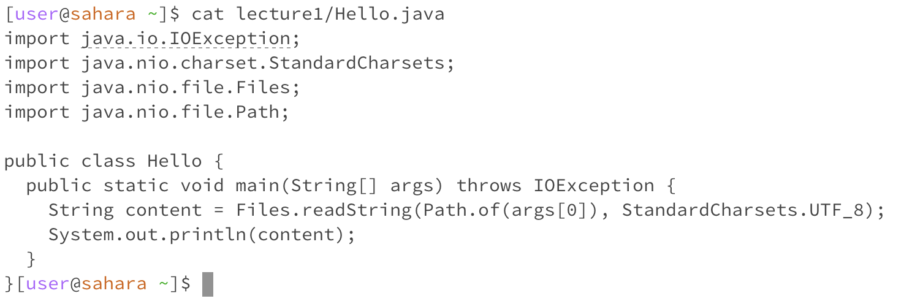

# Remote Access and FileSystem

## Command with no arguments
1. *cd* command:

 

- **cd** with no arguments looks like it didn't execute anything but it returns us to our home directory
- no error

2. *ls* command:

 

- **ls** with no arguments shows what is in the current directory, in this instance the direcotry Lecture1 is shown
- no error

3. *cat* command:

 

- results in an error
- **cat** expects a filename as an argument so running it without an argument will produce an error.

## Command with path to directory
1. *cd* command:

 

- working directory is changed to the specified directory using the **cd** command, in this instance the new directory is 'lecture1'
- no error

2. *ls* command: 

 

- **ls** with no arguments lists the contents of the specified directory, in this instance the directory 'lecture1'
- no error

3. *cat* command:

 

- **cat** with path to directory will result in an error
- command is used to display the contents of files, not directories. Trying to use it on a directory will produce an error.

## Command with path to file
1. *cd* command:

 

- results in an error
- command is used to change directories, not files; it is used to navigate to a specific file.

2. *ls* command: 

 

- This command will list the specified file
- no error

3. *cat* command:

 

- This command will display the contents of the specified file, it displays the content of the specified file on the terminal.
- no error
