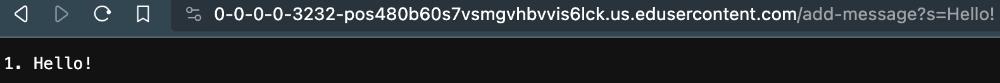
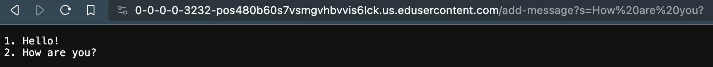
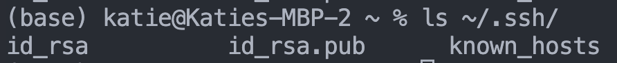
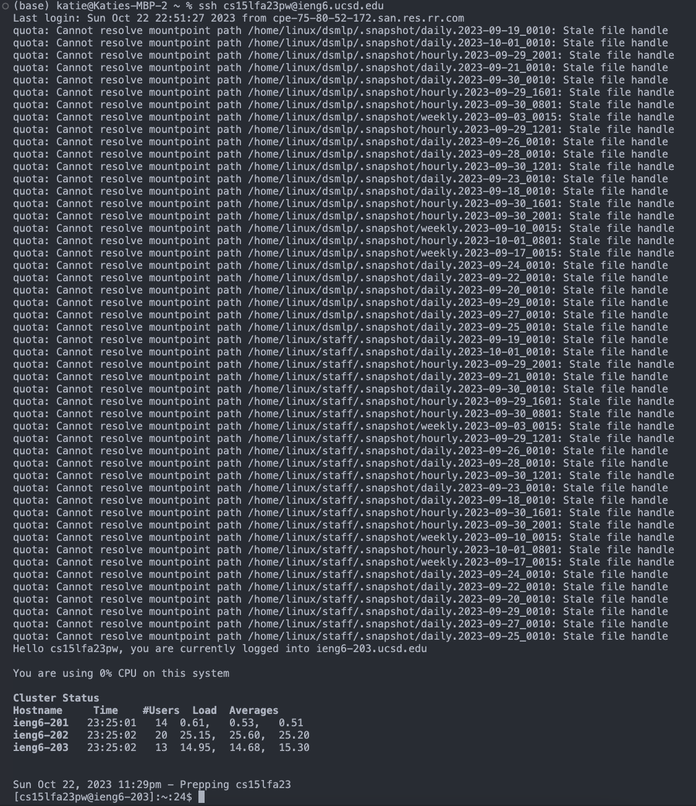

# Lab 2 : Servers and SSH Keys

## Part I - StringServer

#### Code for StringServer.java: 

```
import java.io.IOException;
import java.net.URI;
import java.net.URLDecoder;
import java.nio.charset.StandardCharsets;

class StringHandler implements URLHandler {
    private StringBuilder messageBuffer = new StringBuilder();
    private int messageCounter = 0;

    public String handleRequest(URI url) {
        if (url.getPath().equals("/add-message")) {
            String query = url.getQuery();
            if (query != null) {
                String[] params = query.split("=");
                if (params.length == 2 && params[0].equals("s")) {
                    try {
                        String decodedMessage = URLDecoder.decode(params[1], StandardCharsets.UTF_8.toString());
                        messageCounter++;
                        messageBuffer.append(messageCounter).append(". ").append(decodedMessage).append("\n");
                        return messageBuffer.toString();
                    } catch (IOException e) {
                        e.printStackTrace();
                    }
                }
            }
        }
        return "Invalid request! Use /add-message?s=<message>";
    }
}

public class StringServer {
    public static void main(String[] args) throws IOException {
        if (args.length == 0) {
            System.out.println("Missing port number! Try any number between 1024 to 49151");
            return;
        }

        int port = Integer.parseInt(args[0]);

        Server.start(port, new StringHandler());
    }
}
```
#### Using /add-message 
**First request: "Hello!"**



1. Methods Called
- The handleRequest(URI url) method in the StringHandler class is called.

2. Relevant arguments/fields
- The URI object contains the request path and query string: /add-message?s=Hello!
- The messageBuffer (initially empty) and messageCounter (initially 0) fields in the StringHandler class are relevant.

3. Changing values
- The messageCounter is incremented from 0 to 1.
- The messageBuffer is updated with the message "1. Hello" (appended to the empty buffer).
- The response will be "1. Hello."

**Second request: "Hello!"**



1. Methods Called
- The handleRequest(URI url) method in the StringHandler class is called.

2. Relevant arguments/fields
- The URI object contains the request path and query string: /add-message?s=How are you?
- The messageBuffer (contains "1. Hello") and messageCounter (1) fields in the StringHandler class are relevant.

3. Changing values
- The messageCounter is incremented from 1 to 2.
- The messageBuffer is updated with the message "2. How are you" (appended to the existing message).

## Part II : Private Key

**Path to public and private key**



- private key: ~/.ssh/id_rsa
- public key: ~/.ssh/id_rsa.pub

**Login**



As seen in the screenshot, there was no password prompt and I was able to login directly using my key

## Part III : Topics Learned
Learning what is needed to code a basic web server was an eye-opening experience. What surprised me the most was the ability to handle queries and requests directly from the URL, a skill I didn't realize was so accessible. It's fascinating how these servers can interpret and respond to specific URL paths and query parameters, making it possible to create dynamic and interactive web applications.
