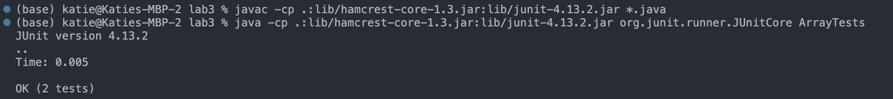

# Part I: Bugs
- failure inducing input:
```
@Test
  public void testReverseInPlace() {
    int[] arr = {1, 2, 3, 4, 5};
    ArrayExamples.reverseInPlace(arr);
    int[] expected = {5, 4, 3, 2, 1};
    assertArrayEquals(expected, arr);
}
```

- input that does not induce failure:
```
@Test
public void testReverseInPlaceNoFailure() {
  int[] arr = {5, 4, 3, 2, 1};
  ArrayExamples.reverseInPlace(arr);
  int[] expected = {5, 4, 3, 2, 1};
  assertArrayEquals(expected, arr);
}
```

- screenshot:


**Bug Description:**

In the `reverseInPlace` method, the current implementation does not correctly reverse the input array. It attempts to reverse the array in-place but has a logical error, which results in incorrect output.

**Before Code (Buggy):**
```
static void reverseInPlace(int[] arr) {
  for(int i = 0; i < arr.length; i += 1) {
    arr[i] = arr[arr.length - i - 1];
  }
}
```

**After Code (Fixed):**
```
static void reverseInPlace(int[] arr) {
  int n = arr.length;
  for (int i = 0; i < n / 2; i++) {
    int temp = arr[i];
    arr[i] = arr[n - i - 1];
    arr[n - i - 1] = temp;
  }
}
```

In the buggy code, the loop traverses the entire array, but the swapping logic is incorrect. It assigns the same value to all elements, effectively reversing the array incorrectly.

The fixed code addresses the issue by using a standard array reversal technique. It iterates only up to half of the array, swapping the elements between the start and end of the array. This approach correctly reverses the array in place.

By making this change, the reverseInPlace method now functions as intended and reverses the input array correctly.


