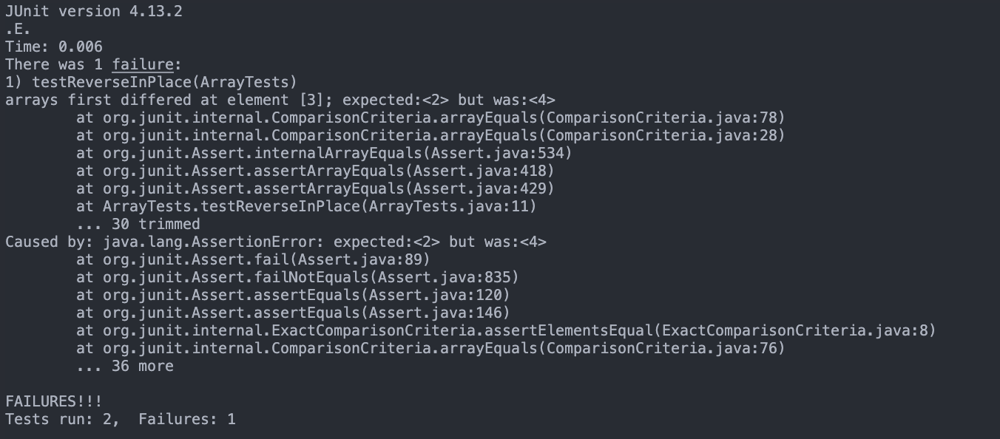

# Part I: Bugs
File: ArrayExamples.java
Buggy Method: reverseInPlace

- failure inducing input: {1, 2, 3, 4, 5}
```
@Test
  public void testReverseInPlace() {
    int[] arr = {1, 2, 3, 4, 5};
    ArrayExamples.reverseInPlace(arr);
    int[] expected = {5, 4, 3, 2, 1};
    assertArrayEquals(expected, arr);
}
```

- input that does not induce failure: {1, 1, 1, 1, 1}
```
@Test
  public void testReverseInPlace() {
    int[] arr = {1, 1, 1, 1, 1};
    ArrayExamples.reverseInPlace(arr);
    int[] expected = {1, 1, 1, 1, 1};
    assertArrayEquals(expected, arr);
}
```

- screenshot:


**Before Code (Buggy):**
```
static void reverseInPlace(int[] arr) {
    for(int i = 0; i < arr.length; i += 1) {
        arr[i] = arr[arr.length - i - 1];
    }
}
```

**After Code (Fixed):**
```
static void reverseInPlace(int[] arr) {
    for(int i = 0; i < arr.length / 2; i += 1) {
        int temp = arr[i];
        arr[i] = arr[arr.length - i - 1];
        arr[arr.length - i - 1] = temp;
    }
}

```
The issue in the buggy method was caused by overwriting the values of the array during the iteration, resulting in an incorrect reversal. The original code attempted to reverse the array by assigning values directly from the end of the array to the beginning. However, this approach led to overwriting values and, therefore, an incorrect reversal. The fixed code uses a temporary variable to swap elements between the start and end of the array, ensuring a correct reversal.

# Part II: Researching Commands

For this section, I researched options for the 'grep' command.

### 1. Option: '-i' (ignore-case search)
Example 1:
```
(base) katie@Katies-MBP-2 docsearch % grep -i "specification" ./technical/biomed/1471-213X-1-13.txt 
        Specification of cells at different times and places is
        Lateral inhibition, or lateral specification, is one
        excess neural tissue arose from specification of excess
        possibility that Notch activity promotes specification of
          specification. First, all normally developing neural cell
          specification of primary motor neuron identity, we probed
          Delta-Notch signaling regulates specification of
          regulate specification of motor neuronal identity.
          operate during specification of individual neural fates
          neuronal specification: that the mechanisms that specify
          specified cells. Specification of a particular cellular
          specification of secondary motor neurons by holding them
        primary motor neuron specification: when we removed primary
```

Example 2:
```
(base) katie@Katies-MBP-2 docsearch % grep -i "FOUNDATION" ./technical/911report/chapter-2.txt 
            THE FOUNDATION OF THE NEW TERRORISM
                allowed to dissolve. They established what they called a base or foundation (al
                Foundation in Sarajevo, which supported the Bosnian Muslims in their conflict with
```

The -i option in grep is useful because it enables a case-insensitive search. When you use grep without the -i option, the search is case-sensitive, meaning it will only match lines that have the exact same case as the pattern you're searching for.

Source: https://man7.org/linux/man-pages/man1/grep.1.html

### 2. Option: '-n' (show line numbers)
Example 1:
```
(base) katie@Katies-MBP-2 docsearch % grep -n "recommendations" ./technical/government/Alcohol_Problems/DraftRecom-PDF.txt 
10:recommendations from conference deliberations. Before the
11:conference, he and Daniel Pollock drafted recommendations for the
13:committee modified those recommendations, and they were distributed
16:achieve unanimity regarding the recommendations, but to have
18:be to discuss the recommendations one by one, identifying any gaps
20:sequence of the recommendations did not imply a priority order.
21:Because the published recommendations will include supporting text,
42:Gordon Smith suggested that the recommendations should address
54:recommendations.
57:to patients. Perhaps the recommendations should address alcohol
91:Edward Bernstein pointed out that the recommendations would
96:research recommendations with a recommendation that included
122:Daniel Pollock added that the message of the recommendations
151:clinicians understand the recommendations better. If we do not, a
257:Catherine Gordon proposed that the recommendations address the
314:recommendations to the high-risk environment in which these people
321:explicit somewhere in the recommendations.
374:Ries thought that the recommendations should encourage studying
392:Pat Lenaghan suggested that clinicians need recommendations
555:General comments about the recommendations
557:proposed recommendations, Hungerford asked if they had general
558:comments about the recommendations overall.
```

Example 2:
```
(base) katie@Katies-MBP-2 docsearch % grep -n "mortality" ./technical/biomed/1468-6708-3-1.txt 
8:        associated with increased mortality in those over age 65.
11:        between body mass index (BMI) and mortality, controlling
28:        on health than on mortality. If so, then behavior change
31:        decreased mortality. Clinical trials powered to detect
130:          related to mortality and morbidity in previous studies,
354:          mortality.
402:        criticized for emphasizing mortality rather than health. We
404:        present in the mortality analysis, suggesting that YHL may
```

The -n option is valuable because it displays the line numbers to the matched output, providing a quick reference to the location of the pattern within the file. The inclusion of line numbers enhances precision and clarity of grep searches, especially in when dealing with large files.

Source: https://man7.org/linux/man-pages/man1/grep.1.html

### 3. Option: '-r' (recursive search)
Example 1: 
```
(base) katie@Katies-MBP-2 docsearch % grep -r "controversial" ./technical/911report 
./technical/911report/chapter-13.5.txt:                process for these radios remains controversial, and they proved unpopular with the
./technical/911report/chapter-13.5.txt:                however.) The most controversial press release, on September 18, quoted EPA
./technical/911report/chapter-13.5.txt:                controversial release that specifically declared the air safe to breathe was
./technical/911report/chapter-3.txt:                budget, these operations have at times been controversial and over time have
./technical/911report/chapter-3.txt:                is sometimes controversial for this very reason. It played no role in judging the
./technical/911report/chapter-6.txt:                uncontroversial," since he was known as someone who "broke china," but she and
./technical/911report/chapter-12.txt:                Some of the most controversial provisions of the Patriot Act are to "sunset" at the
./technical/911report/chapter-12.txt:                end of 2005. Many of the act's provisions are relatively noncontroversial, updating
./technical/911report/chapter-11.txt:                has often played this role, and is sometimes controversial for this very
./technical/911report/chapter-11.txt:                glaring vulnerabilities to dangerous threats would be too costly, too controversial,
```

Example 2: 
```
(base) katie@Katies-MBP-2 docsearch % grep -r "controversial" ./technical/government 
./technical/government/About_LSC/commission_report.txt:8 The controversial "Bracero" Program operated between 1942 and
./technical/government/About_LSC/commission_report.txt:(describing prior programs as "quite controversial for many
./technical/government/About_LSC/commission_report.txt:was controversial, given the history of prior temporary
./technical/government/About_LSC/LegalServCorp_v_VelazquezDissent.txt:politically controversial uses to which LSC funds could be put.
./technical/government/Gen_Account_Office/pe1019.txt:results from case studies is controversial with regard to
./technical/government/Gen_Account_Office/July11-2001_gg00172r.txt:interpretation of this increase is controversial: It is not clear
./technical/government/Gen_Account_Office/Testimony_d01609t.txt:prepared to meet the complex, controversial, and multidimensional
./technical/government/Gen_Account_Office/Testimony_d01609t.txt:the complex, controversial, and multidimensional issues and
./technical/government/Gen_Account_Office/d03273g.txt:controversial subject.
./technical/government/Gen_Account_Office/June30-2000_gg00135r.txt:that electronic comment processes for controversial rules on which
./technical/government/Gen_Account_Office/June30-2000_gg00135r.txt:controversial rules with technical elements and on which commenter
./technical/government/Gen_Account_Office/June30-2000_gg00135r.txt:controversial, so AMS decided to take advantage of IT's potential
./technical/government/Gen_Account_Office/June30-2000_gg00135r.txt:rulemaking features in other potentially controversial
./technical/government/Gen_Account_Office/June30-2000_gg00135r.txt:relatively uncontroversial rules; and may be a less effective use
./technical/government/Gen_Account_Office/d01591sp.txt:resources available for investment, but this idea is controversial.
./technical/government/Gen_Account_Office/d01591sp.txt:A more controversial measure of personal saving would include
./technical/government/Gen_Account_Office/d01591sp.txt:controversial. Federal Reserve Chairman Greenspan, among others,
./technical/government/Gen_Account_Office/og96022.txt:embodied in the controversial 1992 rule would be useful prior to
./technical/government/Gen_Account_Office/Paper_Walker11-2002_acpro122.txt:controversial issue, in part due to recent events, we're getting a
./technical/government/Post_Rate_Comm/Gleiman_EMASpeech.txt:established procedures for expedited treatment of non-controversial
./technical/government/Media/The_State_of_Pro_Bono.txt:Taking unpopular clients and controversial cases is another
./technical/government/Media/Entities_Merge.txt:controversial advocacy of the poorest of the poor - last week took
./technical/government/Media/Bridging_legal_aid_gap.txt:This isn't a controversial issue. Close to nine in 10 Americans
```

The -r option is valuable because it allows us to performrecursive searches, enabling the exploration of directories and their subdirectories for a specified pattern. This can be particularly useful when dealing with large codebases or complex directory structures, providing a convenient means to search comprehensively across multiple files. The option enhances efficiency in tasks involving automated scripting or when conducting thorough examinations of text content spread throughout directory hierarchies.

Source: https://man7.org/linux/man-pages/man1/grep.1.html

### 4. Option '-A' (after)
Example 1:
```
(base) katie@Katies-MBP-2 docsearch % grep -A 2 "cardiovascular" ./technical/biomed/1468-6708-3-1.txt
        trials to detect survival differences or cardiovascular
        events [ 10 ] . In this paper we study whether BMI at
        baseline is associated with living longer, and/or with more
--
          cardiovascular disease (prevalent heart disease,
          peripheral vascular disease, or cerebrovascular disease),
          maximum thickness of the internal carotid artery,
```

Example 2:
```
(base) katie@Katies-MBP-2 docsearch % grep -A 1 "investment" ./technical/plos/journal.pbio.0020001.txt 
        developed countries accounted for some 84% of the global investment in scientific research
        and development, had approximately 72% of the world researchers, and produced approximately
--
        publications and the total number of publications when corrected for investment in research
        and development (May 1997). The proportional change in the number of publications, using
--
        productivity is remarkable when we compare it with the relatively low investment in science
        itself as compared with the GDP of Latin America as a whole. In fact, Albornoz (2001)
--
        of its resources in scientific research and development. Latin American investment in
        research and development represented only 0.59% of the regional GDP in 1998, a very weak
--
        rate as well as in financial investment in science and technology. Some countries have
        performed particularly well. For example, Uruguay, Chile, Panama, and Cuba averaged,
--
        development investment in the 10 years studied, which is notoriously high compared with
        United States (1.5) and even Canada (3.3) (RICYT 2002). Other countries, such as Costa
--
        the decreasing trends in the number of publications per investment dollar in Canada and
        United States could reflect a trend towards more costly research in larger scientific
--
        to the sciences will be an excellent investment by developing nations in terms of
        publications as a measure of scientific output, particularly if these publications can
```

The '-A' option useful because it allows users to retrieve not only the lines containing a specified pattern but also a specified number of lines that come after each matching line. This provides valuable context, aiding in the understanding of the surrounding information related to the pattern. It can help users quickly identify and comprehend the sequence of events or information associated with a particular occurrence.

Source: https://man7.org/linux/man-pages/man1/grep.1.html


