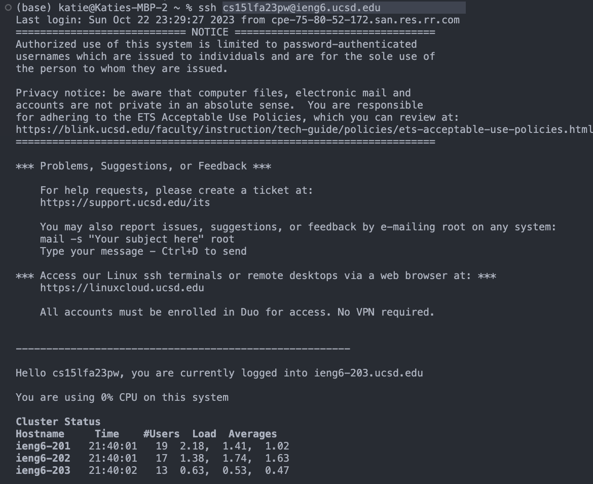
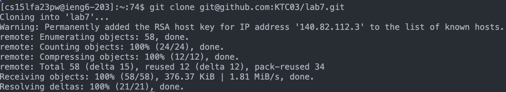
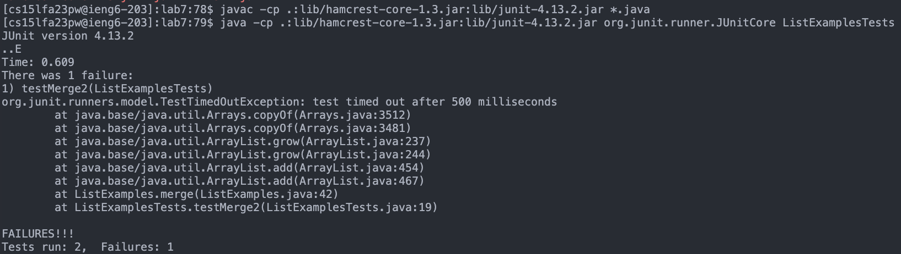
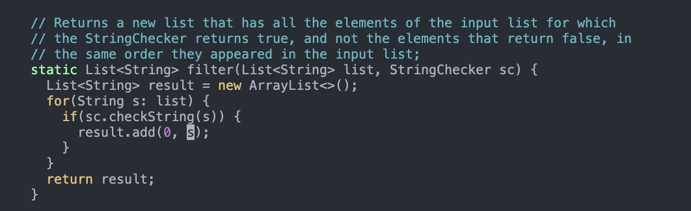
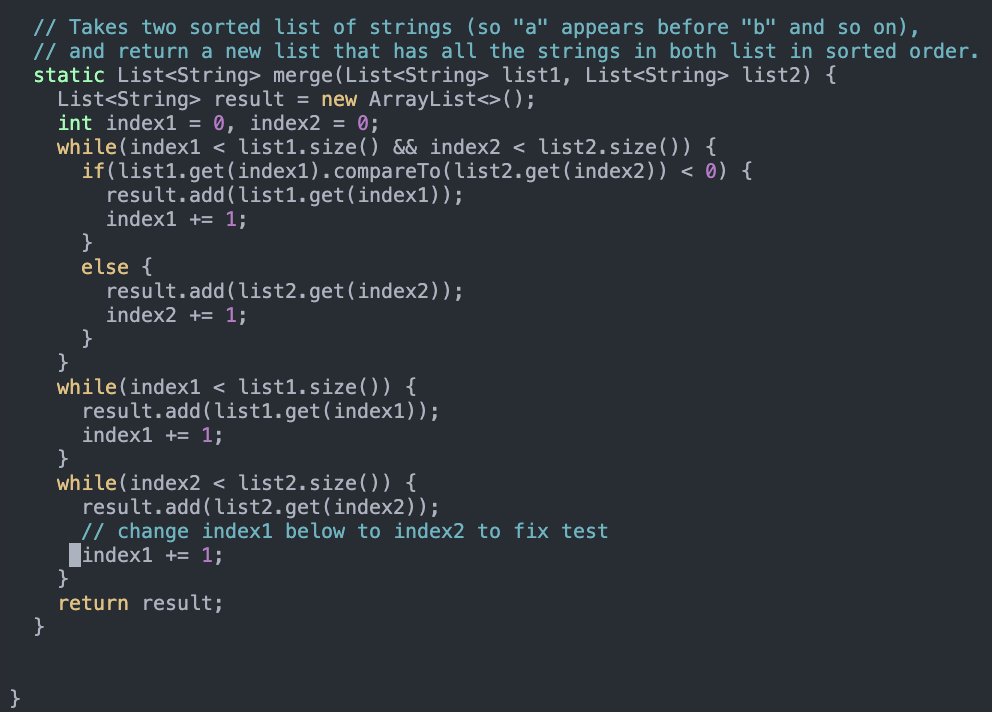
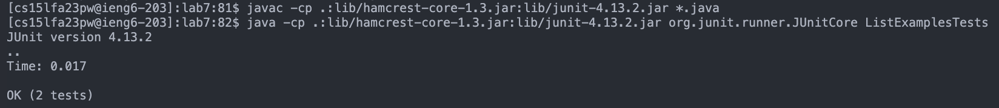
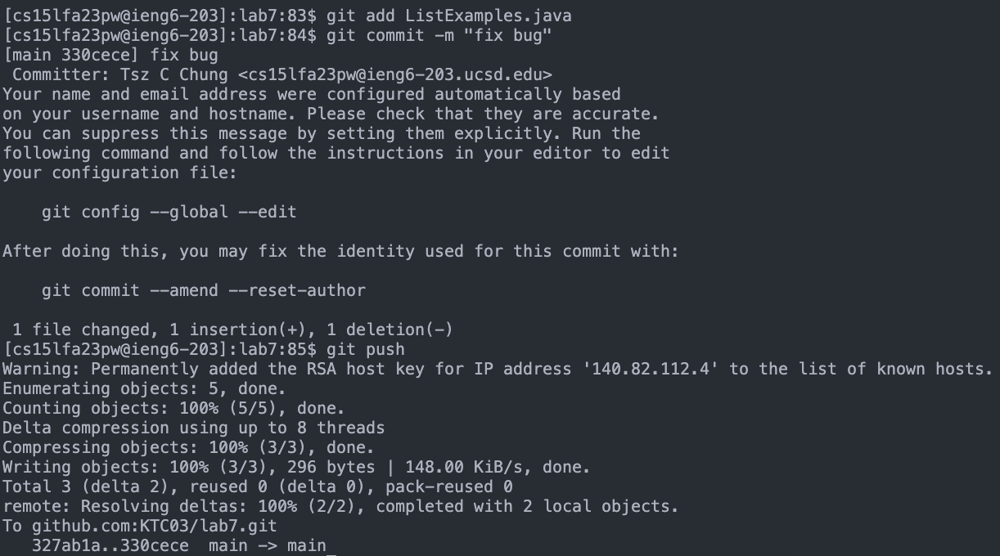

# Lab 4 - Vim

### Step 4: Logging into ieng
- For this step I entered the command "ssh cs15lfa23pw@ieng6.ucsd.edu"

### Step 5: Cloning repo
- I entered the command "git clone git@github.com:KTC03/lab7.git"

### Step 6: Run tests (failure)
1. I entered the command "javac -cp .:lib/hamcrest-core-1.3.jar:lib/junit-4.13.2.jar *.java" to compile the .java files
2. Then I entered "java -cp .:lib/hamcrest-core-1.3.jar:lib/junit-4.13.2.jar org.junit.runner.JUnitCore ListExamplesTests" to run the tests

### Step 7: Editing code to fix failing test
1. vim ListExamples.java
2. <H> <14> <j> <$> - get to the end of line where an error exists
3. <left> <left> <i> <del> <del> <esc> - move cursor and then delete the error that prepended instead of appended the value
   

4. <G><6><up><$><6><left>  - get to error and incorrect variable name causing an infinite loop 
5. <r><2> - replace the 1 in index1 to become index2

6. <:wq> - save and quit file

### Step 8: Run tests (passed)
1. <up><up><enter> - command "javac -cp .:lib/hamcrest-core-1.3.jar:lib/junit-4.13.2.jar *.java" was 2 up in my history
2. <up><up><up><enter> - command "java -cp .:lib/hamcrest-core-1.3.jar:lib/junit-4.13.2.jar org.junit.runner.JUnitCore ListExamplesTests" was 3 up in my history

### Step 9: Commit and Push changes 
1. git add ./ListExamples.java - stage changes made to the file
2. git commit -m "fix bug" - commit message
3. git push - push changes to the repo

