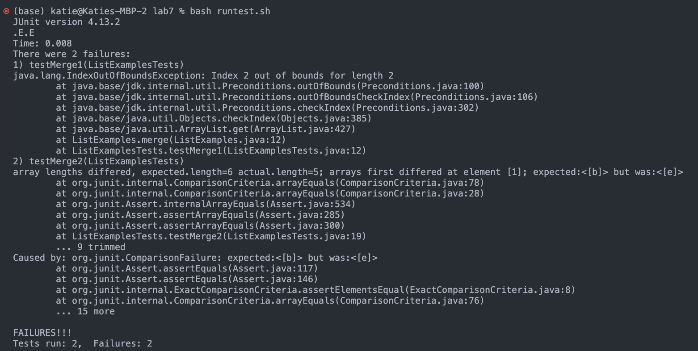
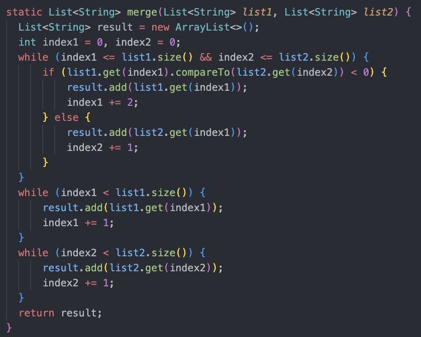
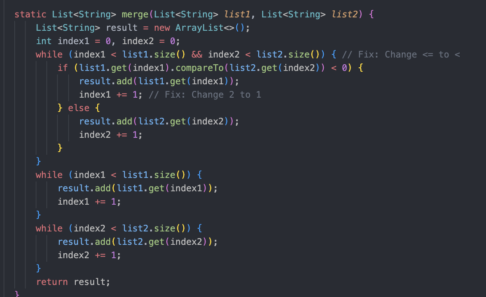

# Part 1: Debugging 

#### Student:
Hi everyone,
I'm having a peculiar issue with the ListExamples class, specifically with the merge method. 
I've included a screenshot of the relevant code, and I'm puzzled by the unexpected output. Here's the screenshot:

It seems like the merge method is not working as expected. I suspect there might be a bug, but I can't quite figure it out. 
Below is a screenshot and any insights would be greatly appreciated!

#### TA: 
Hi there! Thanks for reaching out. It seems the errors you are experiencing may be connected to you while loops in you merge method.
Perhaps try comparing the indices and updating them accordingly. Let me know how that goes!

#### Student Follow-up:
Thanks for the prompt response! I took a closer look at the merge method, specifically the while loop condition as suggested. I made some changes, and here's the updated screenshot:

It appears that the bug in the merge method stemmed from a discrepancy in index management during the comparison of elements from list1 and list2. Specifically, in the else branch, 
the code mistakenly incremented the index for list2 (index2) instead of list1 (index1). This caused the method to add elements from list2 in an unintended order, resulting in incorrect output. 
Additionally, the loop condition allowed the indices to exceed the size of their respective lists, leading to an IndexOutOfBoundsException. 

Fixes: Aadjust the else branch to increment index2 instead of index1 when adding an element from list2 to the result, modify the loop condition to use < instead of <= to prevent index values 
from exceeding the size of their respective lists, resolving the IndexOutOfBoundsException issue.

# Part 2: Reflection
Throughout this class, I feel like I have picked up some cool stuff! More recenlty, actually diving into the debugging process was very interesting and I have a greater appreciation for how complex
debugging code can be. Learning vim also turned out to be way more fun and versatile than I thought – so many commands to play with! I always heard about it before, and how it can help streamline workflow and 
make coding more efficient and now I can truly see why. Finally, one of the morst interesting points in the class for me was finding out how our work gets graded on Gradescope.  This was pretty eye-opening
as I always took the autograder for granted.
